# 🤖 Awesome Physical AI Software — SaaS Platforms, Robotics OS, Simulation, VLA & Open Source

<p align="center">
  
</p>

<p align="center">
  <a href="https://awesome.re/"></a>
  <a href="https://github.com/ishandutta2007/Awesome-Physical-AI-Software/stargazers"></a>
  <a href="https://github.com/ishandutta2007/Awesome-Physical-AI-Software/network"></a>
  <a href="https://github.com/ishandutta2007/Awesome-Physical-AI-Software/blob/main/LICENSE"></a>
  <a href="https://github.com/ishandutta2007/Awesome-Physical-AI-Software/issues"></a>
</p>

## 🌍 Physical AI Software Ecosystem

**Curated list of hosted/SaaS platforms, robotics middleware, simulation engines, robot-learning frameworks, VLA/embodied foundation models, fleet platforms, developer tooling and open-source projects.**

**Last updated: August 2026**

Physical AI software is the **software layer that turns a physical machine into an intelligent, trainable, deployable system**. It spans the full loop from perception and sensor fusion, through world modeling and planning, to control and actuation — plus simulation, synthetic-data generation, evaluation, fleet management and continuous learning.

The category includes everything from classical robotics stacks such as **ROS 2, MoveIt and Gazebo** to new foundation-model stacks such as **OpenVLA, π₀/openpi, SmolVLA and NVIDIA Isaac GR00T**, as well as commercial developer platforms such as **Intrinsic, Viam, Formant, Mujin, PickNik and Wandelbots**.

> **Open-source emphasis:** this README intentionally gives the open ecosystem much more space than the commercial ecosystem. The goal is to make it practical to build a serious Physical AI stack with transparent software wherever the license permits.

### What is included?

- ☁️ **SaaS / Hosted Platforms** — commercial robotics-cloud, development, simulation, fleet-management and AI platforms.
- 🐙 **Open Source** — permissively licensed or community-led software that can form the foundation of a robotics system.
- 🧠 **Open Models / Open Weights** — Physical AI and VLA models where code, weights or both are released, but the release may not meet a strict OSI/open-source definition.
- 🧪 **Research / Benchmarks / Datasets** — important projects for training, evaluation, sim-to-real and embodied-AI research.
- 🧩 **Building Blocks** — perception, optimization, controls, kinematics, datasets, middleware and deployment components.

### ⚠️ Open source vs open weights

Not every project marketed as “open” is equivalent:

| Label | Meaning in this README |
|---|---|
| 🟢 **Open Source** | Source code is publicly available under an OSI-recognized or otherwise clearly permissive/reproducible software license. |
| 🟡 **Open Weights** | Model weights/checkpoints are available, but the license may restrict commercial use or otherwise differ from conventional open source. |
| 🔵 **Research Code** | Public code intended primarily for research/reproduction; production rights or maintenance may vary. |
| 🟠 **Source Available** | Public source is available, but the license is materially restrictive or proprietary. |

Always verify the repository's current `LICENSE` before commercial use.

## 🧭 The Physical AI Software Stack

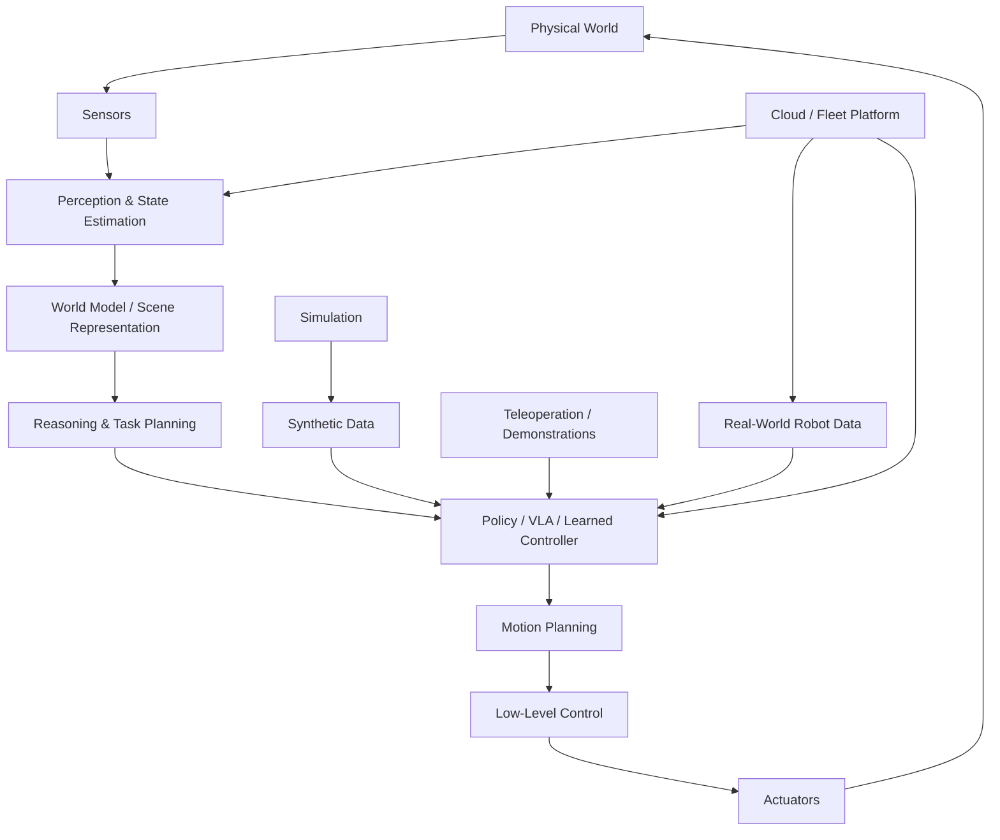

### Software layers at a glance

| Layer | Typical responsibilities | Representative projects / companies |
|---|---|---|
| Robot OS / middleware | Messaging, lifecycle, hardware abstraction, transforms | ROS 2, Open-RMF, YARP, OROCOS |
| Hardware control | Motor controllers, joint control, hardware interfaces | ros2_control, ODrive, SOEM |
| Kinematics / dynamics | FK, IK, dynamics, trajectory generation | MoveIt, Pinocchio, Drake, Crocoddyl |
| Navigation | Localization, mapping, planning, obstacle avoidance | Nav2, SLAM Toolbox, RTAB-Map |
| Perception | Detection, segmentation, tracking, depth, pose | OpenCV, Open3D, YOLO, RTAB-Map |
| Simulation | Physics, sensors, robots, environments | Gazebo, MuJoCo, Isaac Sim, Webots, SAPIEN |
| Robot learning | Imitation learning, RL, behavior cloning | LeRobot, robomimic, RLBench, ManiSkill |
| VLA / foundation models | Vision-language-action policies | OpenVLA, openpi, SmolVLA, Octo, GR00T |
| World models | Predictive/3D generative models | NVIDIA Cosmos, Genie, Dreamer-style research |
| Synthetic data | Scene generation and trajectory generation | Isaac Sim/Omniverse, BlenderProc, DexMimicGen |
| Teleoperation | Human demonstrations and remote control | LeRobot, ALOHA stack, DROID tooling |
| Evaluation | Benchmarks, success-rate and safety evaluation | LIBERO, CALVIN, BEHAVIOR, ManiSkill |
| Fleet / MLOps | OTA, observability, logs, deployment, remote assistance | Formant, Viam, InOrbit, Freedom Robotics |

## 📑 Table of Contents

- ☁️ [SaaS / Hosted Software Platforms](#saas--hosted-software-platforms)
  - [Robot Development & Automation Platforms](#robot-development--automation-platforms)
  - [Fleet Management & Robot Cloud](#fleet-management--robot-cloud)
  - [Simulation / Digital Twin / Industrial AI Platforms](#simulation--digital-twin--industrial-ai-platforms)
  - [Commercial AI / Foundation-Model Platforms](#commercial-ai--foundation-model-platforms)
- 🐙 [Open-Source Software](#open-source-software)
  - [Core Robotics Middleware](#core-robotics-middleware)
  - [Robot Control / Kinematics / Planning](#robot-control--kinematics--planning)
  - [Navigation / SLAM / Mapping](#navigation--slam--mapping)
  - [Simulation & Physics](#simulation--physics)
  - [Robot Learning / Imitation / RL](#robot-learning--imitation--rl)
  - [Vision-Language-Action & Open Robotics Models](#vision-language-action--open-robotics-models)
  - [Embodied AI Benchmarks & Environments](#embodied-ai-benchmarks--environments)
  - [Datasets, Teleoperation & Data Infrastructure](#datasets-teleoperation--data-infrastructure)
  - [Perception / 3D / Computer Vision](#perception--3d--computer-vision)
  - [Optimization / Math / Scientific Computing](#optimization--math--scientific-computing)
  - [Edge / Deployment / Robotics DevOps](#edge--deployment--robotics-devops)
- 🧠 [Open Models / Open Weights](#open-models--open-weights)
- 🧩 [Build-Your-Own Physical AI Stack](#build-your-own-physical-ai-stack)
- 📊 [What Matters Most Economically](#what-matters-most-economically)
- 🗺️ [Reference Architecture](#reference-architecture)
- ❓ [FAQ](#faq)
- 🤝 [How to Contribute](#how-to-contribute)
- ⚠️ [Disclaimer](#disclaimer)

# ☁️ SaaS / Hosted Software Platforms

Commercial platforms are grouped separately from the open-source ecosystem. Enterprise pricing for most robotics platforms is **quote-based**, so this table does **not** pretend that a public list price exists where it does not.

## Robot Development & Automation Platforms

| Platform | Primary focus | Pricing (starting tier) | Free tier / trial | Company size (valuation / funding) |
|---|---|---|---|---|
| [Intrinsic](https://www.intrinsic.ai/) | AI-enabled industrial robotics development, simulation, perception, motion planning and deployment | Custom enterprise pricing (sales-led) | Free developer program access | Part of Alphabet ($2.2T market cap); folded into Google Feb 2026 |
| [Mujin](https://mujin-corp.com/) | Intelligent robot control, motion planning and machine-vision driven automation | Subscription model (quote-based); $233M Series D Dec 2025 | Demo/evaluation available on request | $1B valuation; $411M total raised |
| [Vention](https://vention.io/) | Cloud manufacturing and robotic workcell design | Subscription tiers from $49/mo (Design); enterprise plans available | Free account with limited features; free design tools | $1.2B valuation; $263M total raised; $60M ARR |
| [Wandelbots NOVA](https://www.wandelbots.com/) | Robot programming and no-code/low-code automation | Enterprise pricing (quote-based); $120M raised 2025 | Free developer access and NOVA Cloud beta | ~$300M+ valuation; $123M total raised |
| [RoboDK](https://robodk.com/) | Robot simulation and offline programming | $3,995 (Professional, permanent license) | 30-day free trial with all features; free version limited to 50 lines of code | Private; profitable, bootstrapped |
| [READY Robotics](https://ready-robotics.com/) | Hardware-agnostic robot programming / orchestration | From ~$10,000/yr (RaaS model); acquired by Standard Bots | Free READY Academy training (40+ hrs) | Acquired by Standard Bots ($1B valuation) |
| [PickNik / MoveIt Studio](https://picknik.ai/) | Advanced manipulation development, motion planning and deployment | From $80,000/yr (MoveIt Pro license) | Free trial available; MoveIt open-source core free | $7M total raised; small startup |
| [Rapyuta Robotics / Rapyuta.io](https://www.rapyuta-robotics.com/) | Cloud robotics, orchestration and fleet applications | Subscription-based (quote); zero upfront option | ROI guarantee program; evaluation available | $81M total raised |
| [Intrinsic Flowstate](https://www.intrinsic.ai/flowstate) | Web-based digital-twin development and robotic application lifecycle | Custom enterprise pricing | Free developer sandbox | Part of Alphabet ($2.2T market cap) |
| [Octopuz](https://octopuz.com/) | Offline programming and simulation | Quote-based licensing | Demo available on request | Private; small company |
| [Robotmaster](https://www.robotmaster.com/) | Offline programming, path planning and manufacturing robotics | Quote-based licensing | Free demo available | Private; small company |
| [drag&bot](https://www.dragandbot.com/) | Low-code industrial robot programming | Quote-based (KEBA subsidiary) | Free demo available | Subsidiary of KEBA Group |
| [Rocketfarm](https://rocketfarm.no/) | Robot programming and palletizing software | Quote-based licensing | Demo available on request | Private; small company |

## Fleet Management & Robot Cloud

| Platform | Primary focus | Pricing (starting tier) | Free tier / trial | Company size (valuation / funding) |
|---|---|---|---|---|
| [Viam](https://www.viam.com/) | Hardware-agnostic robotics platform | Usage-based; first $5/mo free, then pay-as-you-go | Free tier: $5/mo included free forever; $30K credits for startups | $117M total raised; Series C Mar 2025 |
| [Formant](https://www.formant.io/) | Robot fleet cloud / observability | $50–$150/vehicle/month (industry benchmarks) | Free tier: 1 user, unlimited robots, unlimited data bandwidth | $45M total raised |
| [InOrbit](https://www.inorbit.ai/) | Robot operations platform | Platform tier is free; enterprise plans quote-based | Free tier: unlimited robots, no credit card required | $12.8M total raised; Series A Sep 2025 |
| [Freedom Robotics](https://freedomrobotics.com/) | Cloud infrastructure for robots | Sales-led pricing | Free tier available; paid plans sales-led | $8M total raised |
| [Foxglove](https://foxglove.dev/) | Robotics visualization and observability | Pro plan from $20/mo; Enterprise custom | Free tier: 3 developer seats, 10 GB storage, unlimited panels | $55M total raised; Series B Nov 2025 |
| [Sereact](https://sereact.ai/) | Vision-language-action robotics software | Enterprise pricing (sales-led); per-robot deployment | Demo/evaluation available | $1.35B valuation; $150M total raised |
| [Dexory](https://www.dexory.com/) | Autonomous warehouse intelligence | Subscription-based (RaaS model); quote-based | Demo/evaluation available | $205M+ total raised; Series C Oct 2025 |
| [Cogniteam](https://www.cogniteam.com/) | Cloud robotics platform / orchestration | Nimbus platform: quote-based | Free tier available for developers | $9.8M total raised |
| [Robotnik cloud tools](https://robotnik.eu/) | Mobile robotics fleet tooling | Quote-based; hardware + software bundles | Demo available on request | Private; small company |
| [Apera AI](https://apera.ai/) | 4D vision for industrial robotics | Vue software: quote-based licensing | Demo/evaluation available | Strategic investment from Zebra Technologies |

## Simulation / Digital Twin / Industrial AI Platforms

| Platform | Focus | Pricing (starting tier) | Free tier / trial | Company size (valuation / revenue) |
|---|---|---|---|---|
| [NVIDIA Isaac Sim](https://developer.nvidia.com/isaac/sim) | Robotics simulation and synthetic data | Free for development; Omniverse Enterprise ~$4,500/GPU/year for production | Free developer license (non-production); Apache 2.0 open source | NVIDIA: $215.9B revenue (FY2026); $3.4T market cap |
| [NVIDIA Omniverse](https://www.nvidia.com/en-us/omniverse/) | Industrial 3D/digital-twin platform | Free tier; Enterprise from $4,500/GPU/year | Free individual tier with limited rendering | NVIDIA: $215.9B revenue (FY2026); $3.4T market cap |
| [NVIDIA Isaac Lab](https://developer.nvidia.com/isaac/lab) | Robot learning at scale | Free (open source / source available) | Free; open-source components | NVIDIA: $215.9B revenue (FY2026); $3.4T market cap |
| [Siemens Xcelerator / Industrial Copilot](https://www.siemens.com/global/en/products/xcelerator.html) | Industrial engineering and AI | Custom enterprise pricing | Free developer access to Xcelerator marketplace | Siemens: €19.4B quarterly revenue; ~$130B market cap |
| [Dassault Systèmes 3DEXPERIENCE](https://www.3ds.com/3dexperience) | Industrial digital twins / engineering | Custom enterprise pricing (quote-based) | 30-day free trial available | €6.24B revenue (2025); ~$55B market cap |
| [AWS RoboMaker](https://aws.amazon.com/robomaker/) | Cloud robotics development services | Pay-as-you-go (simulation SU-hours) | Free tier: first 25 SU-hours/month (discontinued Sep 2025) | Part of Amazon: $580B+ revenue; $2T+ market cap |
| [Google Cloud Robotics / Vertex AI](https://cloud.google.com/) | Cloud AI infrastructure for robotics | Pay-as-you-go (GCP pricing) | Free tier: $300 credits for new accounts | Part of Alphabet: $350B+ revenue; $2.2T market cap |
| [Azure AI + Physical AI Toolchain](https://github.com/microsoft/physical-ai-toolchain) | Cloud-to-robot development | Pay-as-you-go (Azure pricing) | Free tier: $200 Azure credits | Part of Microsoft: $245B+ revenue; $3.1T market cap |
| [Ansys](https://www.ansys.com/) | Physics, simulation and digital engineering | Custom enterprise pricing | Free student/academic licenses; eval available | Acquired by Synopsys for $35B (2025) |
| [Altair](https://altair.com/) | Simulation / optimization | Custom enterprise pricing | Free Altair University access; eval available | Acquired by Siemens for $10.6B (2025) |

## Commercial AI / Foundation-Model Platforms

| Company / platform | Physical AI focus | Pricing (starting tier) | Free tier / trial | Company size (valuation / revenue) |
|---|---|---|---|---|
| [NVIDIA Robotics / Isaac](https://www.nvidia.com/en-us/industries/robotics/) | Isaac, GR00T, Cosmos, simulation, inference and accelerated libraries | Free developer tools; enterprise licensing for production | Free developer license; open-source components | $215.9B revenue (FY2026); $3.4T market cap |
| [Figure AI](https://www.figure.ai/) | Humanoid intelligence and robot foundation models | RaaS model (per-robot deployment) | N/A (hardware company) | $39B valuation; $1B+ raised (Series C Sep 2025) |
| [Skild AI](https://www.skild.ai/) | General-purpose omni-bodied robot brain | Usage-based licensing (sales-led) | N/A (enterprise AI platform) | $14B valuation; $2.2B total raised; $30M revenue |
| [Physical Intelligence](https://www.physicalintelligence.company/) | General robot intelligence and π-series models | Enterprise licensing (sales-led) | Open-weight models available (π₀, π₀-FAST) | $5.6B valuation (talks at $11B); $1.07B raised |
| [World Labs](https://www.worldlabs.ai/) | Spatial/world models | Enterprise licensing (sales-led) | Research demos available | ~$5B valuation; $1B raised (Feb 2026) |
| [Apptronik](https://apptronik.com/) | Humanoid robotics / Apollo ecosystem | RaaS model (per-robot deployment) | N/A (hardware company) | $5.5B valuation; $935M total raised |
| [Covariant](https://covariant.ai/) | AI for industrial robot manipulation | Acquired by Amazon (Sep 2024); licensing model | N/A (acquired) | Acquired by Amazon for ~$400M; previously $625M valuation |
| [Agility Robotics](https://www.agilityrobotics.com/) | Digit humanoid autonomy | RaaS model ($25K+/unit or RaaS contract) | N/A (hardware company) | $2.1B valuation; $641M raised; SPAC planned |
| [FieldAI](https://www.fieldai.com/) | Generalized robot autonomy for unstructured environments | Enterprise licensing (sales-led) | N/A (enterprise platform) | $2B valuation; $405M total raised |
| [Generalist AI](https://www.generalistai.com/) | General robot intelligence | Enterprise licensing (sales-led) | N/A (enterprise platform) | $2B valuation; $400M raised (Jun 2026) |

> **Important:** many “platform companies” in Physical AI are not pure SaaS businesses. They sell a combination of software, robot hardware, deployment services and long-term support. They are included because their software layer is strategically important to Physical AI.

# 🐙 Open-Source Software

This is the core of the list. The projects below are grouped by the software layer they provide rather than by company.

## Core Robotics Middleware

### 1. [ROS 2](https://github.com/ros2)
**🟢 Open Source — Apache 2.0 components**

The dominant open robotics middleware ecosystem. Provides DDS-based communication, lifecycle management, tools, message definitions, transforms and a huge hardware/software ecosystem.

**Physical AI role:** the integration layer between models, sensors, planners and robot hardware.

### 2. [ros2_control](https://github.com/ros-controls/ros2_control)
**🟢 Open Source — hardware/control framework**

Standardizes hardware interfaces and real-time robot controllers in ROS 2. A crucial bridge from learned policies or planners to motors and actuators.

### 3. [ros2_controllers](https://github.com/ros-controls/ros2_controllers)
**🟢 Open Source — Apache 2.0**

Reusable joint, trajectory, differential-drive and related controllers designed to work with ros2_control.

### 4. [Open-RMF](https://github.com/open-rmf/rmf)
**🟢 Open Source**

Open Robotics middleware for coordinating fleets of heterogeneous robots in buildings and other shared environments.

**Best for:** hospitals, warehouses, campuses and multi-vendor robot fleets.

### 5. [YARP](https://github.com/robotology/yarp)
**🟢 Open Source — robot middleware**

Long-running middleware for distributed humanoid and research robotics, especially useful in multi-process and multi-sensor systems.

### 6. [Orocos](https://www.orocos.org/)
**🟢 Open Source**

Real-time robotics control framework used in research and industrial systems.

### 7. [micro-ROS](https://github.com/micro-ROS/micro-ROS.github.io)
**🟢 Open Source**

ROS 2 on microcontrollers and resource-constrained embedded systems.

### 8. [Cyclone DDS](https://github.com/eclipse-cyclonedds/cyclonedds)
**🟢 Open Source**

High-performance DDS implementation suitable for ROS 2 communication.

### 9. [eProsima Fast DDS](https://github.com/eProsima/Fast-DDS)
**🟢 Open Source**

DDS middleware used heavily within ROS 2 deployments.

## Robot Control / Kinematics / Planning

### 10. [MoveIt 2](https://github.com/moveit/moveit2)
**🟢 Open Source**

The leading open manipulation framework for ROS 2: motion planning, collision checking, kinematics, trajectory generation and manipulation pipelines.

### 11. [MoveIt Task Constructor](https://github.com/moveit/moveit_task_constructor)
**🟢 Open Source**

Task-level manipulation planning with composable planning stages.

### 12. [Navigation2 (Nav2)](https://github.com/ros-navigation/navigation2)
**🟢 Open Source**

The canonical ROS 2 navigation stack for mobile robots, including planners, controllers, behavior trees, localization and recovery.

### 13. [Pinocchio](https://github.com/stack-of-tasks/pinocchio)
**🟢 Open Source — BSD-style**

Fast rigid-body algorithms for kinematics, dynamics, analytical derivatives and model-based control.

### 14. [Drake](https://github.com/RobotLocomotion/drake)
**🟢 Open Source**

Robotics toolbox from MIT's RobotLocomotion group emphasizing rigorous multibody dynamics, optimization, planning and control.

### 15. [Crocoddyl](https://github.com/loco-3d/crocoddyl)
**🟢 Open Source**

Optimal-control library for robotics, especially whole-body and legged motion.

### 16. [Tesseract Robotics](https://github.com/tesseract-robotics)
**🟢 Open Source**

Planning, collision checking and industrial manipulation components with strong process-industry/manufacturing relevance.

### 17. [OMPL](https://github.com/ompl/ompl)
**🟢 Open Source**

Open Motion Planning Library with probabilistic planning algorithms widely used in robotics.

### 18. [TrajOpt](https://github.com/tesseract-robotics/trajopt)
**🟢 Open Source**

Optimization-based motion planning for constrained manipulation.

### 19. [TopiCO](https://github.com/ControlSystems/ControlSystems.jl)
**🟢 Open Source ecosystem**

Useful numerical/control components for robotics research; often paired with modern optimal-control workflows.

### 20. [ACADOS](https://github.com/acados/acados)
**🟢 Open Source**

Embedded optimal-control framework frequently used for model-predictive control on robots and autonomous systems.

### 21. [CasADi](https://github.com/casadi/casadi)
**🟢 Open Source**

Symbolic/numeric optimization framework used to build trajectory optimization and MPC systems.

## Navigation / SLAM / Mapping

### 22. [SLAM Toolbox](https://github.com/SteveMacenski/slam_toolbox)
**🟢 Open Source**

A major ROS 2 SLAM package for 2D mapping and localization.

### 23. [RTAB-Map](https://github.com/introlab/rtabmap)
**🟢 Open Source**

RGB-D, stereo and LiDAR SLAM with graph optimization and 3D mapping.

### 24. [Cartographer](https://github.com/cartographer-project/cartographer)
**🟢 Open Source**

Google-origin 2D/3D SLAM system; still a useful reference and research stack.

### 25. [LIO-SAM](https://github.com/TixiaoShan/LIO-SAM)
**🟢 Open Source / Research**

LiDAR-inertial odometry and mapping, widely used as a research baseline for outdoor robots and autonomous systems.

### 26. [FAST-LIO](https://github.com/hku-mars/FAST_LIO)
**🟢 Open Source / Research**

High-performance LiDAR-inertial odometry for real-time robotic mapping.

### 27. [VINS-Fusion](https://github.com/HKUST-Aerial-Robotics/VINS-Fusion)
**🟢 Open Source / Research**

Visual-inertial and multi-sensor state estimation.

### 28. [ORB-SLAM3](https://github.com/UZ-SLAMLab/ORB_SLAM3)
**🟢 Research code**

Visual, visual-inertial and multi-map SLAM supporting monocular, stereo and RGB-D setups.

## Simulation & Physics

### 29. [Gazebo](https://github.com/gazebosim/gz-sim)
**🟢 Open Source**

The canonical open robotics simulator in the ROS ecosystem. Modern Gazebo supersedes Gazebo Classic.

**Physical AI role:** simulation, sensor modeling, robot testing and sim-to-real workflows.

### 30. [MuJoCo](https://github.com/google-deepmind/mujoco)
**🟢 Open Source — Apache 2.0**

Fast physics engine originally developed for robotics research and now open sourced by Google DeepMind.

### 31. [Brax](https://github.com/google/brax)
**🟢 Open Source**

JAX-based differentiable physics / massively parallel simulation for reinforcement learning.

### 32. [SAPIEN](https://github.com/haosulab/SAPIEN)
**🟢 Open Source**

Physics-based simulator with strong support for manipulation and embodied AI.

### 33. [ManiSkill](https://github.com/haosulab/ManiSkill)
**🟢 Open Source**

GPU-parallelized manipulation simulator and benchmark with thousands of simulated task instances; supports modern robot-learning pipelines.

### 34. [robosuite](https://github.com/ARISE-Initiative/robosuite)
**🟢 Open Source**

Modular simulation framework and benchmark for robot learning, manipulation and human demonstrations.

### 35. [PyBullet](https://github.com/bulletphysics/bullet3)
**🟢 Open Source**

Widely used Python-accessible rigid-body physics environment for robotics and reinforcement learning.

### 36. [Webots](https://github.com/cyberbotics/webots)
**🟢 Open Source**

Full robotics simulator supporting mobile robots, manipulators, sensors and ROS integration.

### 37. [CoppeliaSim](https://github.com/CoppeliaRobotics)
**🟡 Source Available / mixed licensing**

Highly capable robot simulator used across industrial, academic and research applications; check the current license for the exact component before commercial redistribution.

### 38. [Drake](https://github.com/RobotLocomotion/drake)
**🟢 Open Source**

Also qualifies as a simulation/plant modeling framework, especially for optimization-heavy robotics.

### 39. [Isaac Lab](https://github.com/isaac-sim/IsaacLab)
**🟡 Source Available / NVIDIA ecosystem**

Open code around NVIDIA Isaac workflows for robot learning and massively parallel simulation. The software is highly visible in Physical AI training, but licensing should be checked component-by-component.

### 40. [Newton Physics Engine](https://github.com/newton-physics/newton)
**🟢 Open Source / collaborative project**

Modern robotics-oriented physics engine effort involving NVIDIA, Google DeepMind and Disney Research, designed around high-performance simulation for robot learning.

## Robot Learning / Imitation / RL

### 41. [Hugging Face LeRobot](https://github.com/huggingface/lerobot)
**🟢 Open Source**

One of the most important open ecosystems for modern robot learning. Provides hardware integrations, datasets, policies, training code and deployment tooling.

Includes support around approaches such as ACT, diffusion policies, SmolVLA and integration with newer VLA systems.

### 42. [robomimic](https://github.com/ARISE-Initiative/robomimic)
**🟢 Open Source**

Benchmark and framework for learning from human demonstrations, especially behavioral cloning and offline imitation learning.

### 43. [robosuite](https://github.com/ARISE-Initiative/robosuite)
**🟢 Open Source**

Simulation + demonstrations + manipulation benchmark; frequently paired with robomimic.

### 44. [Stable-Baselines3](https://github.com/DLR-RM/stable-baselines3)
**🟢 Open Source**

PyTorch reinforcement-learning algorithms used broadly in robotics research and experimentation.

### 45. [RL Games](https://github.com/Denys88/rl_games)
**🟢 Open Source**

High-performance RL algorithms frequently used with GPU-parallelized simulation.

### 46. [TorchRL](https://github.com/pytorch/rl)
**🟢 Open Source**

PyTorch's modular reinforcement-learning framework with strong potential for robotics experimentation.

### 47. [CleanRL](https://github.com/vwxyzjn/cleanrl)
**🟢 Open Source**

Single-file RL implementations useful for research reproducibility and algorithmic benchmarking.

### 48. [Diffusion Policy](https://github.com/real-stanford/diffusion_policy)
**🟢 Open Source / Research**

A landmark diffusion-policy implementation for visuomotor control and imitation learning.

### 49. [ACT — ALOHA / Action Chunking with Transformers](https://github.com/tonyzhaozh/act)
**🟢 Open Source / Research**

Action-chunking transformer policy that helped establish the modern imitation-learning workflow around low-cost teleoperated manipulation datasets.

### 50. [Octo](https://github.com/octo-models/octo)
**🟢 Open Source / Research model**

Generalist robot policy pretrained on a large multi-robot demonstration mixture, intended as a strong starting point for downstream adaptation.

### 51. [DROID](https://github.com/droid-dataset/droid)
**🔵 Research dataset / tooling**

Large-scale open robotics data project focused on real-world manipulation demonstrations; valuable for training and evaluation.

### 52. [DexMimicGen](https://github.com/NVlabs/dexmimicgen)
**🔵 Research code / public dataset tooling**

Automated generation of bimanual dexterous manipulation data in simulation, including environments and datasets designed for imitation learning.

### 53. [MimicGen](https://github.com/NVlabs/mimicgen)
**🔵 Research code**

Framework for generating large robot demonstration datasets from a smaller set of human demonstrations using simulation.

## Vision-Language-Action & Open Robotics Models

### 54. [OpenVLA](https://github.com/openvla/openvla)
**🟡 Open Weights / research code**

A 7B vision-language-action model trained on Open X-Embodiment data. One of the most important open VLA baselines for manipulation research.

### 55. [Physical Intelligence openpi](https://github.com/Physical-Intelligence/openpi)
**🟡 Open Weights / source available**

Official open-source model repository for π₀, π₀-FAST and π₀.5. The project states that its base checkpoints are trained on more than 10,000 hours of robot data. Hardware and compute requirements can be substantial.

### 56. [SmolVLA](https://github.com/huggingface/lerobot)
**🟡 Open model within LeRobot**

Compact VLA designed to make robot foundation-model experimentation more accessible on relatively constrained hardware.

### 57. [RDT-1B](https://github.com/thu-ml/RDT-1B)
**🔵 Research / open model code**

1B-parameter diffusion-transformer approach for language-conditioned bimanual manipulation.

### 58. [OpenHelix](https://github.com/OpenHelix-Team/OpenHelix)
**🟢 MIT licensed code**

Open-source reimplementation and research stack for a dual-system VLA model for robotic manipulation.

### 59. [OpenVLA-OFT](https://github.com/moojink/openvla-oft)
**🔵 Research code**

Fine-tuning / optimization techniques for deploying OpenVLA-style systems with stronger action prediction performance.

### 60. [FAST](https://github.com/Physical-Intelligence/fast)
**🟡 Research / source available**

Action-tokenization approach associated with π₀-FAST; useful for understanding the data/sequence representation side of VLA inference.

### 61. [GROOT-N](https://github.com/NVIDIA/Isaac-GR00T)
**🟡 Open model / NVIDIA license**

NVIDIA's open general-purpose humanoid robot foundation-model ecosystem; connects perception/reasoning to robot actions and is integrated with Isaac tooling.

### 62. [NVIDIA Cosmos](https://github.com/nvidia-cosmos)
**🟡 Open models / source varies by component**

World-foundation-model ecosystem for generating and reasoning about physical environments and synthetic training data.

### 63. [Microsoft Physical AI Toolchain](https://github.com/microsoft/physical-ai-toolchain)
**🟢 Open Source**

Open production-oriented framework combining cloud data infrastructure with NVIDIA physical-AI workflows for data curation, augmentation, evaluation and training.

## Embodied AI Benchmarks & Environments

### 64. [LIBERO](https://github.com/Lifelong-Robot-Learning/LIBERO)
**🔵 Research benchmark / code**

Benchmark suite for lifelong robot learning and language-conditioned manipulation.

### 65. [CALVIN](https://github.com/mees/calvin)
**🔵 Research benchmark / code**

Long-horizon language-conditioned manipulation benchmark with an interactive environment.

### 66. [RLBench](https://github.com/stepjam/RLBench)
**🟢 Open Source / research benchmark**

Large collection of manipulation tasks built for robot-learning research.

### 67. [BEHAVIOR-1K](https://github.com/StanfordVL/BEHAVIOR-1K)
**🔵 Research benchmark / open environment**

Large embodied-AI benchmark centered on household activities and long-horizon interaction.

### 68. [Habitat-Lab](https://github.com/facebookresearch/habitat-lab)
**🟢 Open Source / research framework**

Meta's embodied-AI research framework for navigation, rearrangement and instruction-following in 3D environments.

### 69. [Habitat-Sim](https://github.com/facebookresearch/habitat-sim)
**🟢 Open Source / research**

High-performance 3D embodied-AI simulator.

### 70. [AI2-THOR](https://github.com/allenai/ai2thor)
**🟢 Open Source / research**

Interactive 3D environment widely used for embodied AI and household-agent research.

### 71. [MineDojo](https://github.com/MineDojo/MineDojo)
**🔵 Research ecosystem**

Large-scale embodied-agent environment and benchmark based on Minecraft, including multimodal datasets and task suites.

### 72. [ManiSkill Benchmark](https://github.com/haosulab/ManiSkill)
**🟢 Open Source**

GPU-parallel manipulation benchmark suitable for large-scale policy learning.

## Datasets, Teleoperation & Data Infrastructure

### 73. [LeRobotDataset](https://huggingface.co/docs/lerobot)
**🟢 Open tooling / format**

Standardized dataset format and tooling for robot trajectories, observations, actions and metadata.

### 74. [Open X-Embodiment](https://robotics-transformer-x.github.io/)
**🔵 Open research dataset ecosystem**

Large cross-robot data initiative behind major generalist policy research.

### 75. [ALOHA](https://github.com/MarkFang18/aloha)
**🔵 Research hardware/software ecosystem**

Low-cost bimanual teleoperation and manipulation platform that became a major foundation for imitation-learning research.

### 76. [DROID](https://droid-dataset.github.io/)
**🔵 Open research dataset**

Real-world robot manipulation dataset designed for broad policy learning and transfer.

### 77. [RoboMimic datasets](https://robomimic.github.io/)
**🟢 Research dataset/tooling ecosystem**

Demonstration datasets and reproducible imitation-learning pipelines.

### 78. [MCAP](https://github.com/foxglove/mcap)
**🟢 Open Source — data container format**

High-performance robotics data recording format increasingly used for sensor/telemetry and replay pipelines.

### 79. [Foxglove SDK](https://github.com/foxglove/foxglove-sdk)
**🟢 Open Source components**

SDKs for integrating robotics telemetry and visualization into modern data workflows.

## Perception / 3D / Computer Vision

### 80. [OpenCV](https://github.com/opencv/opencv)
**🟢 Open Source**

The foundational computer-vision library used throughout robotics perception stacks.

### 81. [Open3D](https://github.com/isl-org/Open3D)
**🟢 Open Source**

3D data processing, registration, reconstruction and visualization.

### 82. [PCL — Point Cloud Library](https://github.com/PointCloudLibrary/pcl)
**🟢 Open Source**

Major open-source point-cloud processing ecosystem.

### 83. [OpenVINO](https://github.com/openvinotoolkit/openvino)
**🟢 Open Source**

Model optimization and inference toolkit particularly useful for Intel edge deployments.

### 84. [ONNX Runtime](https://github.com/microsoft/onnxruntime)
**🟢 Open Source**

Cross-platform neural-network inference engine useful for deploying Physical AI models.

### 85. [TensorRT](https://github.com/NVIDIA/TensorRT)
**🟡 Open components / NVIDIA licensing**

GPU inference optimization stack widely used for low-latency robotics workloads.

### 86. [Ultralytics](https://github.com/ultralytics/ultralytics)
**🟡 Open source with commercial-license considerations**

Popular YOLO family implementation for real-time detection and vision workloads. Check current licensing before commercial redistribution.

### 87. [Segment Anything](https://github.com/facebookresearch/segment-anything)
**🟢 Open research code**

General segmentation model that is useful as a perception building block in robot-vision systems.

### 88. [Grounding DINO](https://github.com/IDEA-Research/GroundingDINO)
**🔵 Open research code**

Open-vocabulary detection useful for language-conditioned object grounding.

### 89. [SAM 2](https://github.com/facebookresearch/sam2)
**🟢 Open research code**

Video/image segmentation foundation model useful for tracking objects through manipulation scenes.

## Optimization / Math / Scientific Computing

### 90. [Google OR-Tools](https://github.com/google/or-tools)
**🟢 Open Source**

Constraint programming, routing, linear/mixed-integer optimization and scheduling.

### 91. [CVXPY](https://github.com/cvxpy/cvxpy)
**🟢 Open Source**

Python modeling framework for convex optimization; useful for planning and control.

### 92. [Pyomo](https://github.com/Pyomo/pyomo)
**🟢 Open Source**

Optimization modeling framework for large-scale engineering and operations research.

### 93. [Eigen](https://gitlab.com/libeigen/eigen)
**🟢 Open Source**

Core C++ linear algebra package used throughout robotics.

### 94. [NumPy](https://github.com/numpy/numpy)
**🟢 Open Source**

Numerical foundation for Python robotics/AI stacks.

### 95. [SciPy](https://github.com/scipy/scipy)
**🟢 Open Source**

Scientific computing tools including optimization, interpolation, spatial algorithms and signal processing.

## Edge / Deployment / Robotics DevOps

### 96. [NVIDIA Isaac ROS](https://github.com/NVIDIA-ISAAC-ROS)
**🟡 Open components / NVIDIA license**

GPU-accelerated ROS 2 packages for perception, navigation, manipulation and AI inference at the edge.

### 97. [NVIDIA Jetson software ecosystem](https://developer.nvidia.com/embedded/jetson-modules)
**🟡 Mixed open/proprietary**

The dominant edge-compute ecosystem for running modern Physical AI models on robots.

### 98. [K3s](https://github.com/k3s-io/k3s)
**🟢 Open Source**

Lightweight Kubernetes distribution useful for managing distributed edge compute fleets.

### 99. [Docker](https://github.com/moby/moby)
**🟢 Open Source**

Containerization foundation for reproducible robotics deployments and simulation environments.

### 100. [Tailscale](https://github.com/tailscale/tailscale)
**🟢 Open Source client / commercial service**

Secure networking useful for remote robot access and fleet operations; the hosted control plane is commercial.

# 🧠 Open Models / Open Weights

This section deliberately sits **outside** the strict Open Source list because model licenses and training-data rights differ materially from ordinary software licensing.

| Model / project | Organization | Type | Why it matters |
|---|---|---|---|
| **OpenVLA** | Stanford / collaborators | Open weights + research code | Major 7B VLA baseline trained on Open X-Embodiment |
| **π₀ / π₀-FAST / π₀.5** | Physical Intelligence | Open weights + code | One of the most important modern generalist manipulation VLA families |
| **SmolVLA** | Hugging Face | Open model | Smaller VLA aimed at more accessible hardware |
| **Octo** | UC Berkeley / collaborators | Open model | Generalist diffusion policy across robot embodiments |
| **RDT-1B** | Tsinghua | Open research model | Diffusion-transformer formulation for bimanual manipulation |
| **GR00T N1.x** | NVIDIA | Open model / NVIDIA license | General humanoid foundation-model stack |
| **Cosmos** | NVIDIA | Open model ecosystem | World-model / synthetic-data layer for physical AI |
| **OpenHelix** | OpenHelix Team | Open research model | Dual-system VLA research implementation |
| **Diffusion Policy** | Stanford / collaborators | Open research code | Foundational modern visuomotor policy family |
| **ACT** | ALOHA research ecosystem | Open research code | High-impact action-chunking policy for imitation learning |
| **Segment Anything / SAM 2** | Meta | Open research models | General perception building blocks for embodied systems |
| **Grounding DINO** | IDEA Research | Open research model | Open-vocabulary visual grounding |

## The VLA ecosystem is converging on a common loop

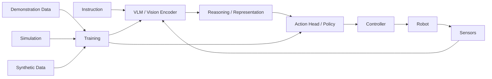

# 🧩 Build-Your-Own Physical AI Stack

A practical open-first stack can be assembled almost entirely from public software.

## Minimal mobile robot

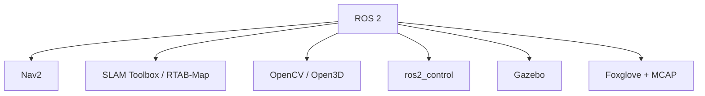

## Manipulation robot

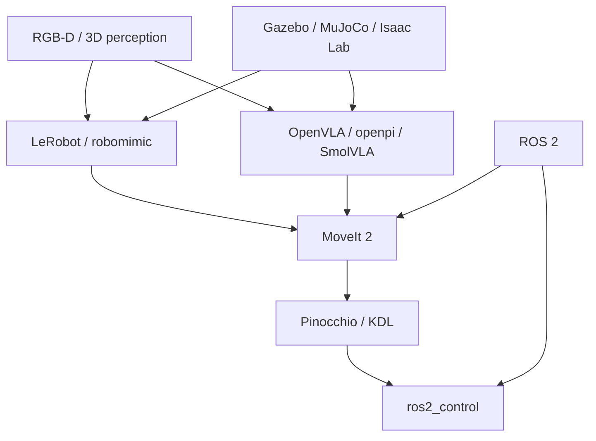

## Full Physical AI platform

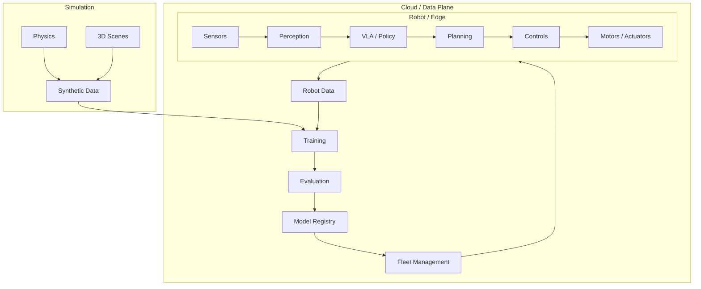

## A strong open-first reference stack

| Function | Recommended open-first choice | Commercial alternative |
|---|---|---|
| Middleware | ROS 2 | Intrinsic / Viam platform layers |
| Hardware control | ros2_control | OEM SDK / proprietary controller |
| Manipulation | MoveIt 2 | MoveIt Studio / Intrinsic |
| Navigation | Nav2 | Commercial autonomy stack |
| Kinematics | Pinocchio | Proprietary planning SDK |
| Dynamics / MPC | Drake / Crocoddyl / ACADOS | Commercial control platform |
| Simulation | Gazebo / MuJoCo / ManiSkill | Isaac Sim / commercial digital twins |
| RL | TorchRL / Stable-Baselines3 / RL Games | Managed training platforms |
| Imitation | LeRobot / robomimic | Commercial robot-learning services |
| VLA | OpenVLA / openpi / SmolVLA | Skild / Covariant / commercial robot brains |
| Synthetic data | BlenderProc / simulator-native tools | Omniverse / commercial data platforms |
| Teleoperation | ALOHA / LeRobot tooling | Commercial teleop platforms |
| Data format | LeRobotDataset / MCAP | Proprietary cloud schemas |
| Visualization | Foxglove | Commercial fleet dashboards |
| Fleet MLOps | Open source Kubernetes + custom APIs | Viam / Formant / InOrbit |
| Perception | OpenCV / Open3D | Commercial vision AI |
| Model serving | ONNX Runtime / TensorRT | Managed edge inference |

# 🧠 The Open-Source Physical AI Data Flywheel

The deepest strategic reason open software matters is not merely licensing. It is **data interoperability**.

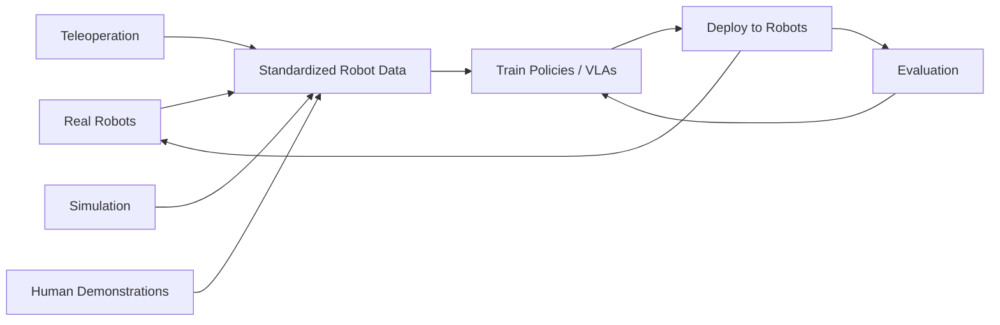

The ecosystem becomes substantially more valuable when the same trajectory, sensor and action representation can be used across:

- different robot manufacturers;
- different simulators;
- different VLA architectures;
- different edge computers;
- different fleet platforms; and
- different evaluation suites.

That is why projects such as **ROS 2, LeRobotDataset, MCAP and Open X-Embodiment** are strategically important even when they are not themselves “AI models”.

# 📊 What Matters Most Economically

Physical AI software has several distinct business models. Treating all of them as SaaS can be misleading.

| Business model | Example | Revenue unit | Typical economics |
|---|---|---|---|
| Developer SaaS | Robotics IDE / simulation platform | Developer / seat / workspace | High gross-margin software |
| Fleet SaaS | Viam, Formant, InOrbit | Robot / month / fleet | Recurring revenue + support |
| Industrial platform | Intrinsic, Mujin | Site / cell / deployment | High ACV, enterprise sales |
| Robot brain | Skild, Covariant, Physical Intelligence | Robot / deployment / usage | AI-software + deployment |
| Simulation | Isaac Sim / commercial simulation | Compute / seat / enterprise | Compute-heavy |
| Data platform | Robot-data management | Storage / robot / usage | Data + compute economics |
| Managed autonomy | Robotics-as-a-Service | Robot-hour / task / site | Blended hardware + software |
| Open core | Commercial support around OSS | Support / cloud / enterprise features | Software + services |

## Where the software value can accumulate

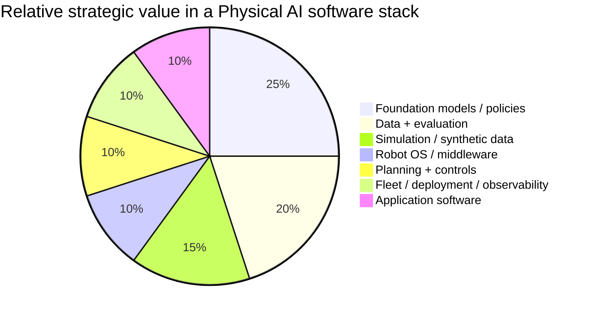

> The pie chart is a **strategic heuristic, not a measured market-share statistic**. The percentages are deliberately illustrative and should not be read as financial forecasts.

# 🔥 High-Opportunity Open-Source Gaps

Several parts of Physical AI are still relatively fragmented and therefore offer attractive opportunities for new open-source projects.

| Gap | Why it matters | What a winning OSS project could provide |
|---|---|---|
| Universal robot data format | Cross-embodiment learning is data constrained | Datasets, schemas, converters, validation and streaming |
| Reproducible VLA evaluation | Benchmarks often differ in hardware and metrics | Standard task suites + hardware adapters + statistical reporting |
| Open fleet MLOps | Open models need production deployment tooling | OTA, model registry, telemetry, rollback and safety gates |
| Sim-to-real evaluation | Simulation success often fails in reality | Automated calibration, replay and domain-gap scoring |
| Robot observability | Robot logs are fragmented | OpenTelemetry-like standard for robotics |
| Safety for learned policies | VLA systems need runtime assurance | Safety supervisors, constraint monitors and recovery policies |
| Cross-embodiment policy adapters | A policy often assumes one robot | Universal action/kinematic abstraction |
| Teleoperation infrastructure | High-quality physical data remains scarce | Cheap teleop + time sync + dataset generation |
| World-model evaluation | Generated environments need physical validity | Benchmarks for contact, geometry, dynamics and causality |
| Edge VLA runtime | Frontier policies are too expensive at the edge | Quantization, distillation, caching and accelerator backends |
| Robot package management | Deployments resemble distributed systems | Signed robot packages, dependency graphs and rollback |
| Open dexterous-hand stack | Hands have fragmented hardware/software APIs | Standard hand interfaces + datasets + policies |

# 🏗️ Open-Source Opportunities by Layer

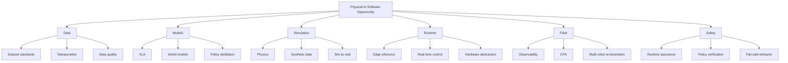

# 🧱 Major Commercial Players vs Open Ecosystem

| Layer | Leading commercial names | Open ecosystem |
|---|---|---|
| Robotics OS | Intrinsic, proprietary OEM stacks | ROS 2, YARP, OROCOS |
| Manipulation | Intrinsic, Mujin, PickNik | MoveIt 2, OMPL, Tesseract |
| Navigation | OEM / autonomy vendors | Nav2, RTAB-Map, SLAM Toolbox |
| Simulation | NVIDIA, Ansys, Siemens, Dassault | Gazebo, MuJoCo, SAPIEN, Webots, PyBullet |
| Robot learning | Covariant, Skild, PI, FieldAI | LeRobot, robomimic, Diffusion Policy, Octo |
| VLA | PI, Skild, NVIDIA, Covariant | OpenVLA, openpi, SmolVLA, RDT, OpenHelix |
| World model | NVIDIA, World Labs, Google DeepMind | Open model/research releases vary |
| Fleet cloud | Viam, Formant, InOrbit, Freedom Robotics | ROS 2 + Kubernetes + Foxglove + custom stacks |
| Perception | Intrinsic and specialist vendors | OpenCV, Open3D, PCL, SAM-family models |
| Data | Proprietary robot data platforms | LeRobotDataset, MCAP, Open X-Embodiment ecosystem |
| Safety | Industrial OEMs / integrators | ROS 2 safety tooling + research code; fragmented |

# 🧬 Who Owns the Physical AI Software Stack?

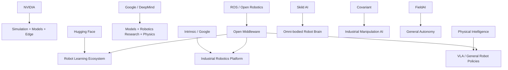

# 🌐 Major Open-Source Communities to Watch

- [ROS](https://www.ros.org/) — the foundational open robotics ecosystem.
- [Open Robotics](https://www.openrobotics.org/) — ROS and Gazebo ecosystem stewardship.
- [Hugging Face Robotics](https://huggingface.co/robotics) — models, datasets and the LeRobot ecosystem.
- [NVIDIA Robotics](https://developer.nvidia.com/robotics) — increasingly influential open-model and robotics framework releases, though not everything is open-source.
- [RobotLocomotion](https://github.com/RobotLocomotion) — dynamics, planning and robotics research software.
- [ARISE Initiative](https://github.com/ARISE-Initiative) — robot-learning simulation and imitation learning.
- [Stanford Vision and Learning Lab](https://github.com/StanfordVL) — embodied-AI and robot-learning research.
- [Meta FAIR Robotics](https://github.com/facebookresearch) — embodied-AI environments and foundation-model research.
- [EAI community](https://github.com/search?q=embodied+AI&type=repositories) — rapidly expanding embodied-agent ecosystem.

# 🔭 Technology Trajectory

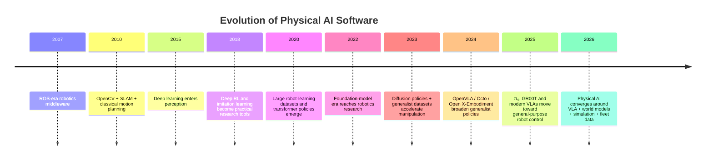

# 🏆 Suggested “Top 20” Starting Point

For a developer who wants the shortest path into Physical AI software, these are the projects/platforms worth understanding first.

| Rank | Project / platform | Category | Why start here? |
|---:|---|---|---|
| 1 | ROS 2 | Middleware | The ecosystem foundation |
| 2 | LeRobot | Robot learning | Best open entry point into modern robot learning |
| 3 | MoveIt 2 | Manipulation | Core planning stack |
| 4 | Gazebo | Simulation | ROS-native simulation |
| 5 | MuJoCo | Physics | Modern research-grade physics |
| 6 | Nav2 | Navigation | Standard open navigation stack |
| 7 | OpenVLA | VLA | Major open VLA reference |
| 8 | openpi | VLA | Important modern open VLA family |
| 9 | ManiSkill | Simulation + benchmark | GPU-scale manipulation learning |
| 10 | robomimic | Imitation | High-quality behavior-cloning stack |
| 11 | robosuite | Simulation | Manipulation benchmark ecosystem |
| 12 | Pinocchio | Dynamics | Excellent kinematics/dynamics foundation |
| 13 | Drake | Planning/control | Powerful optimization-oriented stack |
| 14 | Foxglove | Observability | Practical debugging/data tooling |
| 15 | MCAP | Data | Strong robot-data transport/storage primitive |
| 16 | Habitat-Lab | Embodied AI | Leading 3D embodied benchmark ecosystem |
| 17 | RLBench | Benchmark | Large manipulation task suite |
| 18 | Diffusion Policy | Robot learning | Major modern imitation baseline |
| 19 | Isaac Lab | Simulation/RL | Large-scale Physical AI training |
| 20 | Open-RMF | Fleet orchestration | Multi-robot coordination |

# 🛠️ Example Open-First Projects

## Example A — Build a warehouse AMR stack

```text
ROS 2
 ├── Nav2
 ├── SLAM Toolbox / RTAB-Map
 ├── ros2_control
 ├── OpenCV / PCL
 ├── Gazebo
 └── Foxglove + MCAP
```

## Example B — Build a low-cost manipulation robot

```text
ROS 2
 ├── ros2_control
 ├── MoveIt 2
 ├── Pinocchio
 ├── Gazebo / MuJoCo
 ├── LeRobot
 ├── ACT / Diffusion Policy
 └── OpenVLA / SmolVLA
```

## Example C — Build a VLA training pipeline

```text
Real Robot
   ↓
Teleoperation
   ↓
LeRobotDataset / MCAP
   ↓
Data Cleaning
   ↓
LeRobot / PyTorch
   ↓
OpenVLA / openpi / SmolVLA
   ↓
Simulation Validation
   ↓
Edge Optimization
   ↓
Robot Deployment
   ↓
Fleet Telemetry
   ↓
New Training Data
```

# 🧪 Research vs Production

One of the most important distinctions in Physical AI is that **research success is not production success**.

| Dimension | Research environment | Production environment |
|---|---|---|
| Objective | Benchmark score | Uptime + unit economics |
| Hardware | Known / fixed | Heterogeneous / changing |
| Environment | Curated | Messy / adversarial |
| Failure handling | Reset episode | Safely recover without reset |
| Latency | Often flexible | Hard real-time constraints may apply |
| Dataset | Static | Continually changing |
| Model updates | Manual | Must support rollback / staged deployment |
| Evaluation | Offline benchmark | Long-horizon real-world reliability |
| Safety | Limited | Mandatory |
| Observability | Experiment logs | Fleet-scale telemetry |

# ⚠️ The Hardest Software Problems

Physical AI software is difficult because the software is connected to a system whose state cannot be completely observed and whose failures can have physical consequences.

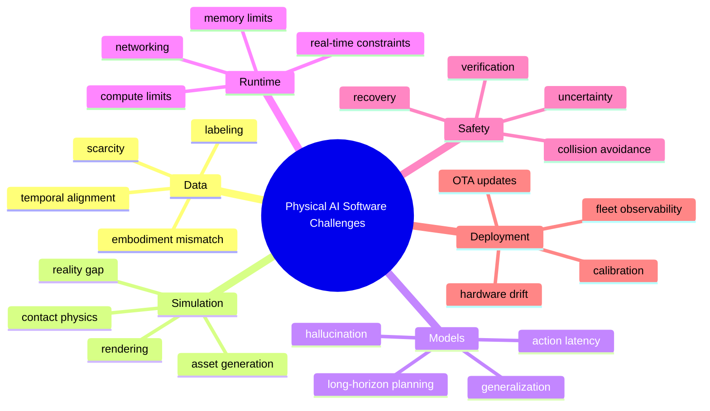

# 📚 Primary References & Further Reading

The following sources are useful starting points for verifying platform capabilities and project status. Repository links above should be treated as the canonical source for licensing and release information.

- [NVIDIA — Physical AI and Robotics](https://www.nvidia.com/en-us/industries/robotics/)
- [NVIDIA — Global Robotics Leaders and Physical AI, March 2026](https://nvidianews.nvidia.com/news/nvidia-and-global-robotics-leaders-take-physical-ai-to-the-real-world)
- [NVIDIA — Open Physical AI Tools and Skills, June 2026](https://investor.nvidia.com/news/press-release-details/2026/NVIDIA-Releases-Major-Collection-of-Open-Source-Agent-Tools-and-Skills-for-Physical-AI/default.aspx)
- [Hugging Face — LeRobot](https://github.com/huggingface/lerobot)
- [Physical Intelligence — openpi](https://github.com/Physical-Intelligence/openpi)
- [OpenVLA](https://github.com/openvla/openvla)
- [NVIDIA Isaac GR00T](https://github.com/NVIDIA/Isaac-GR00T)
- [Microsoft Physical AI Toolchain](https://github.com/microsoft/physical-ai-toolchain)
- [ROS 2](https://github.com/ros2)
- [Gazebo](https://gazebosim.org/)
- [MoveIt](https://moveit.ros.org/)
- [MuJoCo](https://mujoco.org/)
- [ManiSkill](https://github.com/haosulab/ManiSkill)
- [robosuite](https://github.com/ARISE-Initiative/robosuite)
- [Habitat](https://aihabitat.org/)
- [Intrinsic](https://www.intrinsic.ai/)
- [Viam](https://www.viam.com/)
- [Formant](https://www.formant.io/)

# ❓ FAQ

**What exactly is Physical AI software?**  
Software that enables a machine to perceive, reason, learn, plan and act in the physical world. It includes classical robotics software as well as AI models, simulation, data and deployment infrastructure.

**Is ROS 2 itself Physical AI?**  
ROS 2 is not an AI model. It is an open middleware layer that provides the infrastructure through which Physical AI systems connect perception, planning, models, controls and hardware.

**Are OpenVLA and π₀ truly open source?**  
They are best described as **open-model/open-weight ecosystems** rather than automatically equivalent to an ordinary Apache/MIT software library. Licensing differs by release, so check the model's current license and terms before commercial use.

**Why separate SaaS and open source?**  
Because the business models and user incentives differ. SaaS platforms optimize for enterprise deployment, support and managed infrastructure; open-source projects optimize for ecosystem adoption, transparency, composability and developer control.

**Can a company build a production Physical AI system entirely from open source?**  
Yes, for many layers. A practical stack can be built from ROS 2, MoveIt 2, Nav2, Gazebo/MuJoCo, ros2_control, LeRobot, open perception libraries, public VLA research and standard cloud infrastructure. Production certification, safety engineering, hardware drivers and support may still require proprietary components.

**What is the biggest missing layer?**  
There is no universally accepted equivalent of a "Linux + Kubernetes + PyTorch" stack for Physical AI. ROS 2 is the closest middleware foundation, but model formats, data formats, evaluation standards, runtime assurance and fleet MLOps remain fragmented.

# 🤝 How to Contribute

1. Fork this repository.
2. Add or update an entry in the relevant section.
3. Prefer the project's official website and canonical GitHub repository.
4. Include the current license and clearly label **Open Source**, **Open Weights**, **Research Code**, or **Source Available**.
5. Avoid unverified claims about capabilities, customers, pricing or performance.
6. Submit a PR with a short description of what changed.

## Contribution template

```markdown
### [Project Name](https://github.com/example/project)
**🟢 Open Source — Apache 2.0**

One or two factual sentences describing what it does and where it fits in the Physical AI stack.

**Best for:** simulation / navigation / manipulation / perception / learning / deployment.
```

# ⚠️ Disclaimer

- This is a **community-curated technical directory**, not an endorsement.
- The Physical AI software ecosystem changes extremely quickly; repositories, licenses, company products and product availability can change.
- GitHub stars are dynamic and intentionally not treated as a permanent ranking.
- “Open source” is used carefully; where a project is primarily open-weight, research-only or source-available it is labeled accordingly.
- Commercial robotics platforms often bundle software with hardware, integration and services. They are included because their software is strategically important, not because they are pure SaaS businesses.
- Safety-critical robotics requires validation, cybersecurity, deterministic behavior where required, fault handling and compliance with applicable standards. Public software alone does not make a robot production-safe.

# ⭐ Suggested Star-History Setup

```text
https://star-history.com/#ishandutta2007/Awesome-Physical-AI-Software&Date
```

[](https://www.star-history.com/#ishandutta2007/Awesome-Physical-AI-Software&Date)

---

🤖 **Built for developers, researchers, roboticists, startups and open-source communities building the intelligent physical world.**

**Let's make Physical AI more open, interoperable, reproducible and programmable.**
